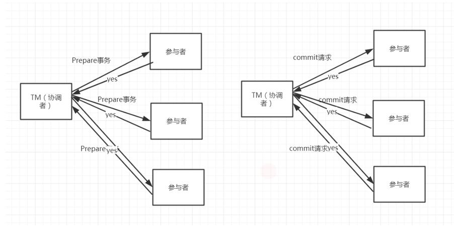

##### X/OpenDTP事务模型（X/Open Distributed Transaction Processing Reference）
Model

- X/Open是一个组织机构，定义出的一套分布式事务标准， 定义了规范的API接口
- 2PC（two -phase-commit）, 用来保证分布式事务的完整性
- J2EE 遵循了X/open DTP规范，设计并实现了java里面的分布式事务编程接口规范-JTA
- XA是X/Open DTP定义的中间件与数据库之间的接口规范。 XA接口函数由数据库厂商提供

X/OpenDTP 角色
- AP application
- RM resouces manager   资源管理器。 数据库
- TM transaction manager  事务管理器，事务协调者

##### 2PC
阶段一：提交事务请求（投票）
- 1.TM向所有的AP发送事务内容，询问是否可以执行事务的提交操作，并等待各个AP的响应
- 2.执行事务，各个AP节点执行事务操作，将undo和redo信息记录到事务日志中，尽量把提交过程中所消耗时间的操作和准备都提前完成后确保后续
  事务提交的成功率
- 3.各个AP向TM反馈事务询问的响应，各个AP成功执行了事务操作，那么反馈给TM yes的response；如果AP没有成功执行事务，就反馈TM no的response

阶段二：执行事务提交

执行提交事务

假设一个事务的提交过程总共需要30s， 其中prepare操作需要28（事务日志落地磁盘及各种io操作），而真正commit只需要2s
那么，commit阶段发生错误的概率和prepare相比， 2/28 (<10%) .只要第一个阶段成功，那么commit阶段出现失败的概率就非常小
大大增加了分布式事务的成功概率

中断事务提交

2pc存在的问题

- 1.数据一致性问题

在二阶段提交的阶段二中，当协调者向参与者发送commit请求之后，
发生了局部网络异常或者在发送commit请求过程中协调者发生了故障，这回导致只有一部分参与者接受到了commit请求。
而在这部分参与者接到commit请求之后就会执行commit操作。但是其他部分未接到commit请求的机器则无法执行事务提交。
于是整个分布式系统便出现了数据部一致性的现象。

- 2.同步阻塞

执行过程中，所有参与节点都是事务阻塞型的。当参与者占有公共资源时，
其他第三方节点访问公共资源不得不处于阻塞状态

- 3.二阶段无法解决的问题：协调者在发出commit消息之后宕机，而唯一接收到这条消息的参与者同时也宕机了。
那么即使协调者通过选举协议产生了新的协调者，这条事务的状态也是不确定的，没人知道事务是否被已经提交

- 4.单点故障。由于协调者的重要性，一旦协调者发生故障。

##### 3PC
- 阶段一：canCommit
- 阶段二：preCommit
- 阶段三：doCommit

改进点

- 增加了超时机制
- 第二阶段，如果协调者超时没有接受到参与者的反馈，则自动认为失败，发送abort命令
- 第三阶段，如果参与者超时没有接受到协调者的反馈，则自动认为成功开始提交事务（基于概率）

3PC的问题

相对于2PC，3PC主要解决的单点故障问题，并减少阻塞，因为一旦参与者无法及时收到来自协调者的信息之后，
他会默认执行commit。而不会一直持有事务资源并处于阻塞状态。但是这种机制也会导致数据一致性问题，
因为，由于网络原因，协调者发送的abort响应没有及时被参与者接收到，那么参与者在等待超时之后执行了commit操作。
这样就和其他接到abort命令并执行回滚的参与者之间存在数据不一致的情况。

